<p align="center">
  
</p>

<h1 align="center">Andrey Vinícius de Souza Silva</h1>

<p align="center">
  <strong>Desenvolvedor Backend Java Jr. • Spring Boot • SQL • Sistemas Corporativos</strong>
</p>

<p align="center">
  <a href="https://linkedin.com/in/andrey-ssilva"></a>
  <a href="https://andreyportifolio.netlify.app"></a>
  <a href="mailto:andreysilvatisuporte@gmail.com"></a>
</p>

---

## 👨‍💻 Sobre mim

Sou profissional de TI e estudante de **Análise e Desenvolvimento de Sistemas**, direcionando minha carreira para **Desenvolvimento Backend Java**.

Atualmente atuo como Assistente de TI, sendo responsável pelo suporte tecnológico da empresa, sistemas ERP, infraestrutura e investigação de inconsistências em processos como estoque e faturamento.

Paralelamente, desenvolvo projetos próprios e acadêmicos utilizando **Java, Spring Boot, SQL, React e Python**, buscando transformar problemas reais em soluções de software.

Também gosto de explorar outras áreas da tecnologia, principalmente **automação, Arduino, ESP32 e integração entre software e hardware**.

```java
public class Andrey {
    String role = "Backend Developer Jr.";
    String focus = "Java + Spring Boot";

    String[] interests = {
        "Backend", "APIs REST", "Software Architecture",
        "ERP", "Automation", "IoT"
    };

    public void nextLevel() {
        learn();
        build();
        test();
        improve();
    }
}
```

---

# ⚡ Tech Stack

### Backend


### Dados


### Outras tecnologias


### Ferramentas


### Hardware & IoT


---

# 🚀 Projetos em destaque

## 💈 Studio L — Sistema de Agendamento e CRM

Sistema web desenvolvido para atender uma necessidade real de uma barbearia.

**Stack:** Java 21 • Spring Boot • PostgreSQL • React • Docker

- agendamento online;
- gerenciamento de serviços;
- horários de funcionamento;
- bloqueios de agenda;
- autenticação administrativa;
- mini CRM;
- notificações;
- aplicação publicada em ambiente de produção.

> Projeto full stack desenvolvido a partir de um problema real e atualmente utilizado em produção.

---

## 🏗️ Caderneta Digital de Obras — CREA-SP

Projeto acadêmico desenvolvido em parceria com o **CREA-SP**.

**Stack:** Java • Spring Boot • React • SQL Server

O sistema digitaliza o acompanhamento de obras e possui recursos para cadastro de obras, profissionais, proprietários e usuários, relatos de visita, termos de conclusão, anexos e histórico das informações.

---

## 🍫 ChocoFlow

Sistema desktop em desenvolvimento para gerenciamento da produção de uma confeitaria.

**Stack:** Java • Swing • SQLite • JDBC • DAO

Possui módulos voltados para insumos, compras, estoque, receitas, produção, remessas, vendas e custos.

---

## 📄 Project Doc Generator

Ferramenta CLI para análise automatizada de projetos e geração de documentação.

**Stack:** Python • Typer • Jinja2 • Dataclasses • Ruff

- análise de estrutura de projetos;
- detecção de tecnologias;
- geração de `project-info.json`;
- geração automática de README;
- evidências encontradas no código;
- arquitetura modular.

✅ Primeira release publicada.

---

# 🤖 Robótica & IoT

### 🎮 Arcade com Arduino

Jogo desenvolvido com Arduino utilizando display, joystick, botões físicos, lógica de inimigos e obstáculos, sistema de vidas e controle de colisões.

### 🚪 Automação de portão com ESP32

Protótipo de automação utilizando ESP32 com controle eletrônico e interface web.

---

# 📚 Atualmente estudando

```text
Java        ███████████████░░░
Spring Boot ████████████░░░░░░
SQL         ███████████░░░░░░░
React       ███████░░░░░░░░░░░
```

- Java e Programação Orientada a Objetos
- Spring Boot e APIs REST
- SQL e bancos relacionais
- Arquitetura e boas práticas de software
- Desenvolvimento Full Stack

---

# 🎓 Formação

**Tecnologia em Análise e Desenvolvimento de Sistemas**  
UNIFAI — 2024 → 2027

---

# 📊 GitHub

<p align="center">
  
  
</p>

---

# 📫 Contato

<p align="center">
  <a href="https://linkedin.com/in/andrey-ssilva"></a>
  <a href="https://andreyportifolio.netlify.app"></a>
  <a href="mailto:andreysilvatisuporte@gmail.com"></a>
</p>

---

<p align="center"><strong>🏁 Construindo um projeto de cada vez.</strong></p>
<p align="center">Java • Backend • Sistemas • Automação • IoT</p>
